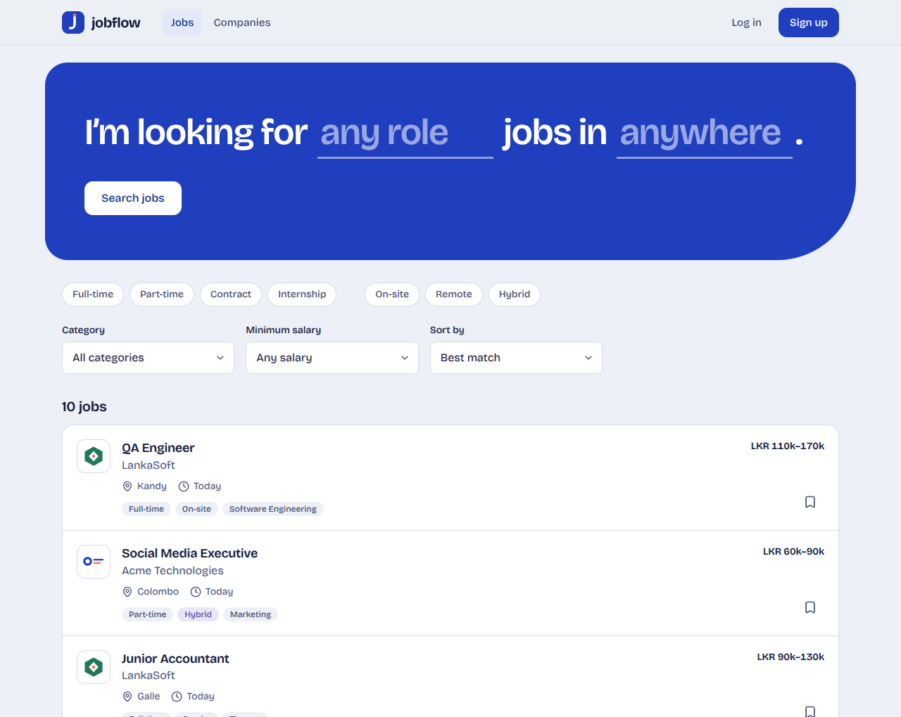
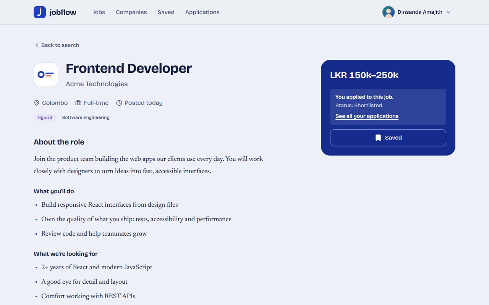
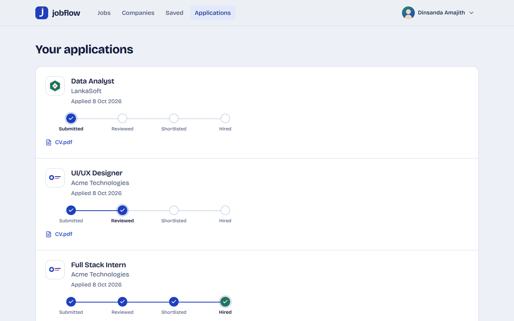
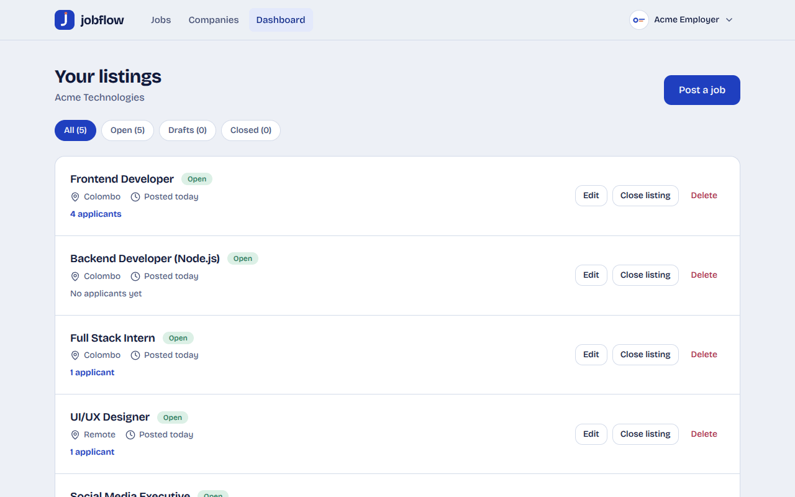
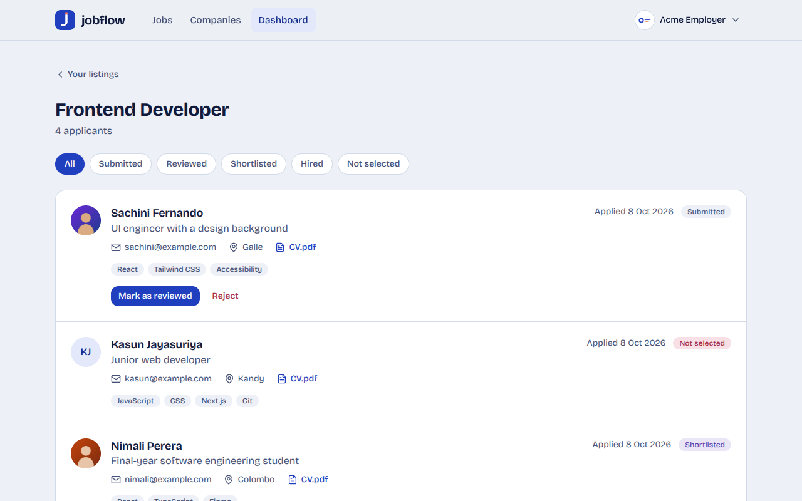
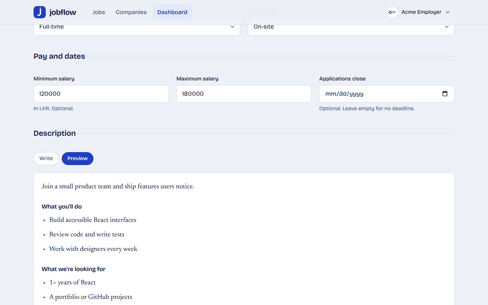
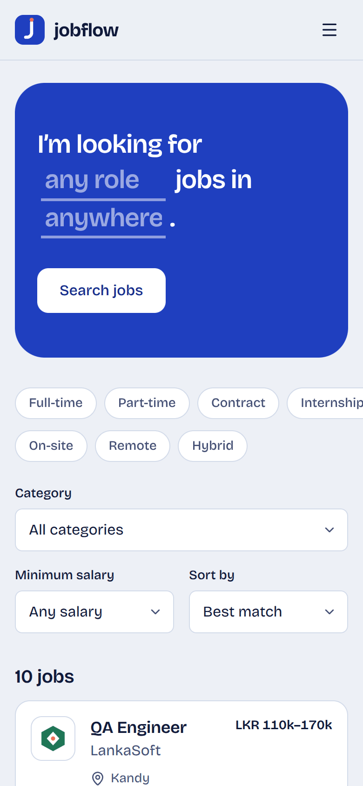
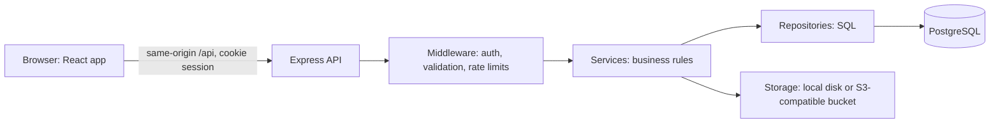

# Jobflow


A full-stack job board. Employers post listings and move applicants through a hiring pipeline; job seekers search,
save jobs and apply with a PDF resume.

**Live demo: https://jobflow-8zdp.onrender.com**

The demo runs on a free host, so the first visit after a quiet spell can take up to a minute to wake up.

There are no shared logins. Create your own account (any email address; no email verification) and choose
**I'm looking for work** to search and apply, or **I'm hiring** to post listings and review applicants. Everything
you create is real data in the app's database, and the job categories come with the database itself.

> Jobflow is a portfolio project. Please don't upload documents you would not want stored (use a dummy PDF for a resume).



## What you can do

**Job seekers**
- Search by keyword and location, and filter by job type, work mode, category and minimum salary. The search lives in
  the URL, so a result page can be shared and the back button works.
- Save jobs, then apply with a cover letter and a PDF resume (upload one per application, or reuse a saved resume).
- Follow every application on a status tracker, and keep a profile with a photo, headline and skills.

**Employers**
- Post, edit, close, reopen and delete listings. Drafts stay private until published, and a live preview shows how the
  description will look.
- Review applicants: read cover letters, download resumes, and move each application from submitted to reviewed,
  shortlisted and hired (or reject it). Only the next valid steps are offered.
- Keep a company profile with a logo that appears on every listing.

## Screenshots

| | |
|---|---|
|  |  |
| **A job page** with salary, a formatted description and one-tap apply or save | **The application tracker** shows where each application stands |
|  |  |
| **The employer dashboard** with listings and applicant counts | **Applicants** with photos, skills, resumes and status actions |
|  |  |
| **Posting a job** with a live preview of the description | **On a phone** the same screens reflow to one column |

## Tech stack

| Layer | Technology |
|---|---|
| Frontend | React 19, Vite, Tailwind CSS 4, React Router, TanStack Query, React Hook Form and Zod |
| Backend | Node.js, Express 5, PostgreSQL (plain SQL with `pg`, no ORM) |
| Authentication | JWT in an httpOnly cookie, bcrypt password hashing, role-based access control |
| Files | `multer` uploads, `sharp` image processing, a storage layer with a local-disk driver and an S3-compatible driver |
| Quality | 68 API integration tests (real PostgreSQL), 42 component and unit tests (Vitest, Testing Library), GitHub Actions CI |
| Deployment | Render, one service that serves both the API and the built React app (see [docs/DEPLOY.md](docs/DEPLOY.md)) |

## How it works



A few decisions worth a closer look:

- **Sessions.** The login token lives in an httpOnly cookie, so page scripts cannot read it. The browser always calls
  `/api` on its own origin (a dev proxy locally, the server itself in production), which keeps the cookie first-party.
  Login gives the same error and takes about the same time for an unknown email and a wrong password, so accounts
  cannot be enumerated.
- **Search.** PostgreSQL full-text search (`tsvector` with a GIN index) plus a title substring match, with filters
  passed as query parameters and results paginated.
- **Private files.** Resumes and seeker photos are never public URLs. They are streamed through the API after a check:
  only the owner, or an employer the person applied to, can open them.
- **Safe uploads.** Files are checked by their content, not their name. Images are decoded and re-encoded, which strips
  hidden metadata such as GPS location, and oversized or malformed images are rejected.
- **Rules live on the server.** Application statuses follow fixed transitions, applying twice is impossible, and every
  edit checks that the employer owns the listing. The UI only mirrors those rules.
- **Tested in a browser too.** Besides the automated suites, the full hiring flow was run in a real browser. That
  caught a bug the unit tests could not: private photos staying in the browser cache after switching accounts.

## Run it locally

You need Node.js 22 and Docker (or any PostgreSQL 16).

```bash
docker compose up -d                  # PostgreSQL on :5432

cd server
cp .env.example .env                  # then set JWT_SECRET to a long random string
npm install
npm run migrate                       # create the tables
npm run seed                          # optional, local only: fake companies, jobs and accounts for development
npm run dev                           # API on http://localhost:5000

cd ../client                          # in a second terminal
npm install
npm run dev                           # app on http://localhost:5173
```

Run the tests with `npm test` in `server` (they use the database from `.env` and clean up after themselves) and in
`client`. `npm run db:reset` in `server` rebuilds the database from scratch.

## Project structure

```
client/    React app (pages, components, API hooks)
server/    Express API (routes, controllers, services, repositories, SQL migrations, tests)
docs/      DESIGN.md, DEPLOY.md, API.md, Postman collection, screenshots
render.yaml, docker-compose.yml, .github/workflows/ci.yml
```

## Documentation

- [docs/API.md](docs/API.md): every endpoint, plus a Postman collection
- [docs/DESIGN.md](docs/DESIGN.md): architecture, UML and ER diagrams, database schema, wireframes
- [docs/DEPLOY.md](docs/DEPLOY.md): deploying for free, limits to re-check, troubleshooting
