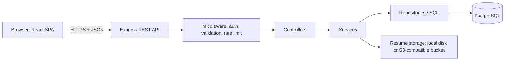
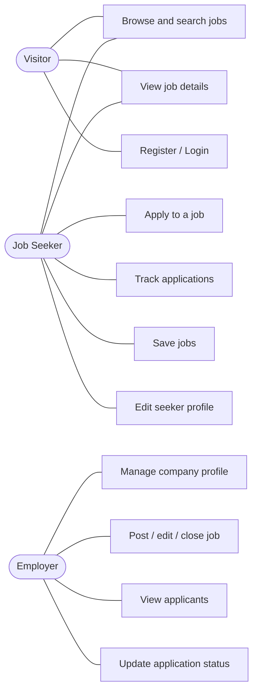
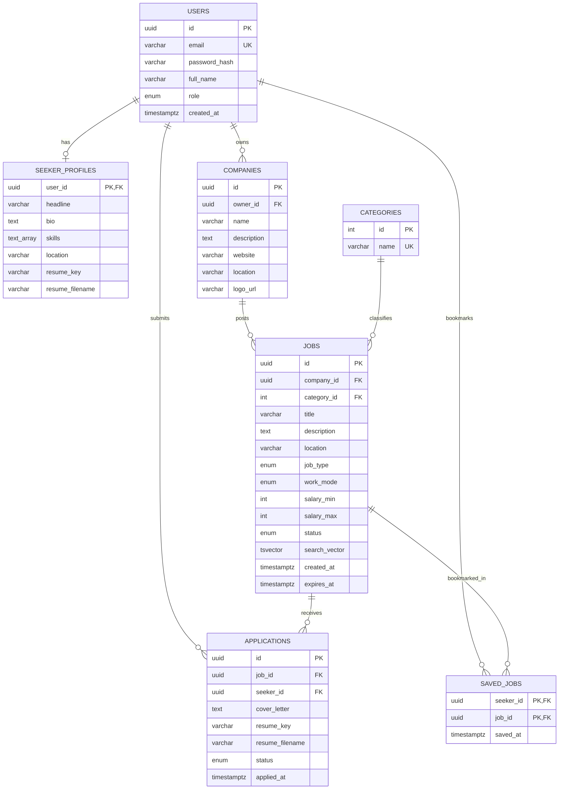
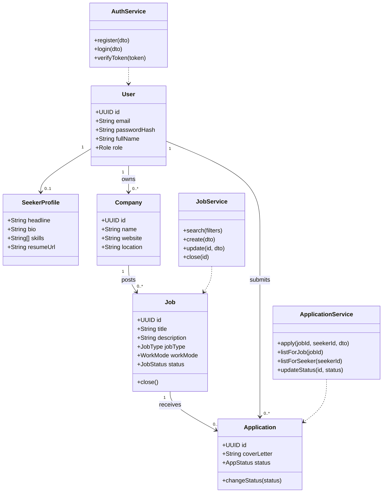
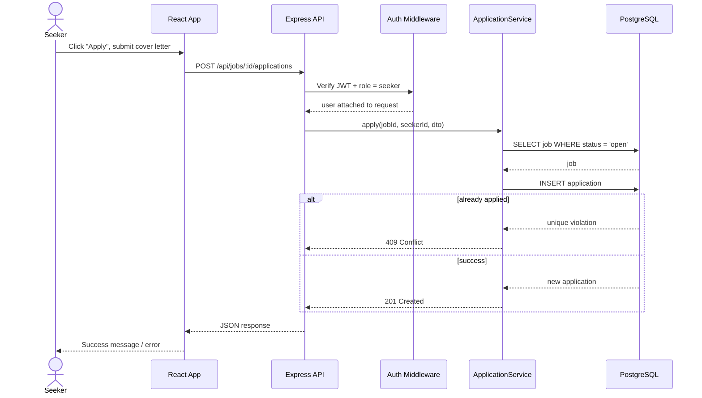
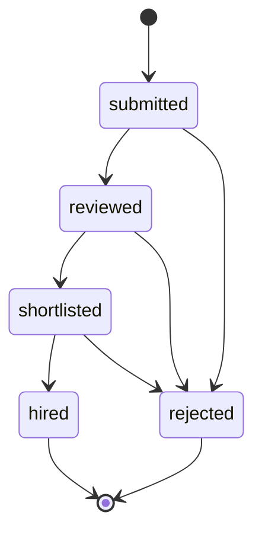

# Jobflow: Design Document

A job board where **employers** post and manage listings and **job seekers** search, filter and apply. This document covers everything to decide before coding.

---

## 1. Scope

**MVP (build this first)**
- Register / login with two roles: `seeker`, `employer`
- Employer: create company profile, post / edit / close jobs, view applicants, change application status
- Seeker: browse, search, filter (category, location, type, work mode), view job, apply with a cover letter and an uploaded resume (PDF), track applications, save jobs
- Public, deployed demo with seeded sample data

**Later (only if time allows)**
- Email notifications, admin moderation, employer analytics, "recommended jobs"

Keeping the MVP small is deliberate: a finished, deployed, clean project is worth more on a CV than a large half-built one.

---

## 2. Tech stack

| Layer | Choice | Why |
|---|---|---|
| Language | JavaScript (ES modules) | Already on your CV; one language front to back. TypeScript is a good upgrade later. |
| Frontend | React + Vite, React Router, Tailwind CSS | Fast dev, matches CV. Tailwind suits your design strength. |
| Data fetching | TanStack Query + Axios | Caching, loading and error states for free |
| Forms / validation | React Hook Form + Zod | Same Zod schemas can be reused on the backend |
| Backend | Node.js + Express | Matches CV |
| Database | PostgreSQL | Relational data (users, jobs, applications) fits perfectly |
| DB access | `pg` with plain SQL migrations (no ORM) | Decided: plain SQL shows you understand schema design |
| Auth | Own JWT + bcrypt (`bcryptjs`), token in an httpOnly cookie, role-based middleware | Listed on your CV; shows real backend skill (Chatflow already uses Clerk). The frontend calls `/api` on its own domain (Vercel rewrite to the API), so the cookie is first-party and works despite browser third-party-cookie blocking. |
| File upload | `multer` (memory storage, PDF only, 5 MB limit) behind a storage service with two drivers: `local` disk (dev) and S3-compatible bucket (production) | Render's disk is ephemeral, so production files need external storage; the driver switch keeps the provider swappable |
| Search | PostgreSQL full-text search (`tsvector` + GIN index) | No extra service needed |
| Security | helmet, cors, express-rate-limit | Basics reviewers look for |
| Testing | Vitest (frontend), Jest + Supertest (API) | A few API tests stand out on a CV |
| Deployment | Render (API + managed Postgres) and Vercel (frontend) | Both already on your CV |
| DevOps touch | Docker + docker-compose for local dev, GitHub Actions CI | Reuses your Chatflow Docker experience |

---

## 3. System architecture



Backend layering: **routes → controllers → services → repositories**. Controllers handle HTTP only; services hold business rules (e.g. "a seeker cannot apply twice"); repositories hold SQL.

---

## 4. Use case diagram



---

## 5. Database design

### 5.1 ER diagram



### 5.2 Schema (PostgreSQL)

```sql
CREATE TYPE user_role   AS ENUM ('seeker', 'employer', 'admin');
CREATE TYPE job_type    AS ENUM ('full_time', 'part_time', 'contract', 'internship');
CREATE TYPE work_mode   AS ENUM ('onsite', 'remote', 'hybrid');
CREATE TYPE job_status  AS ENUM ('draft', 'open', 'closed');
CREATE TYPE app_status  AS ENUM ('submitted', 'reviewed', 'shortlisted', 'rejected', 'hired');

CREATE TABLE users (
  id            UUID PRIMARY KEY DEFAULT gen_random_uuid(),
  email         VARCHAR(255) UNIQUE NOT NULL,
  password_hash VARCHAR(255) NOT NULL,
  full_name     VARCHAR(120) NOT NULL,
  role          user_role NOT NULL,
  created_at    TIMESTAMPTZ NOT NULL DEFAULT now()
);

CREATE TABLE seeker_profiles (
  user_id    UUID PRIMARY KEY REFERENCES users(id) ON DELETE CASCADE,
  headline   VARCHAR(160),
  bio        TEXT,
  skills     TEXT[] DEFAULT '{}',
  location   VARCHAR(120),
  resume_key      VARCHAR(500),   -- storage key of default resume
  resume_filename VARCHAR(255)
);

CREATE TABLE companies (
  id          UUID PRIMARY KEY DEFAULT gen_random_uuid(),
  owner_id    UUID NOT NULL REFERENCES users(id) ON DELETE CASCADE,
  name        VARCHAR(160) NOT NULL,
  description TEXT,
  website     VARCHAR(255),
  location    VARCHAR(120),
  logo_url    VARCHAR(500)
);

CREATE TABLE categories (
  id   SERIAL PRIMARY KEY,
  name VARCHAR(80) UNIQUE NOT NULL
);

CREATE TABLE jobs (
  id            UUID PRIMARY KEY DEFAULT gen_random_uuid(),
  company_id    UUID NOT NULL REFERENCES companies(id) ON DELETE CASCADE,
  category_id   INT  REFERENCES categories(id),
  title         VARCHAR(160) NOT NULL,
  description   TEXT NOT NULL,
  location      VARCHAR(120),
  job_type      job_type NOT NULL,
  work_mode     work_mode NOT NULL,
  salary_min    INT,
  salary_max    INT CHECK (salary_max IS NULL OR salary_max >= salary_min),
  status        job_status NOT NULL DEFAULT 'open',
  search_vector TSVECTOR GENERATED ALWAYS AS (
                  to_tsvector('english', coalesce(title,'') || ' ' || coalesce(description,''))
                ) STORED,
  created_at    TIMESTAMPTZ NOT NULL DEFAULT now(),
  expires_at    TIMESTAMPTZ
);

CREATE TABLE applications (
  id           UUID PRIMARY KEY DEFAULT gen_random_uuid(),
  job_id       UUID NOT NULL REFERENCES jobs(id) ON DELETE CASCADE,
  seeker_id    UUID NOT NULL REFERENCES users(id) ON DELETE CASCADE,
  cover_letter TEXT,
  resume_key      VARCHAR(500) NOT NULL,   -- storage key of uploaded resume
  resume_filename VARCHAR(255) NOT NULL,
  status       app_status NOT NULL DEFAULT 'submitted',
  applied_at   TIMESTAMPTZ NOT NULL DEFAULT now(),
  UNIQUE (job_id, seeker_id)          -- one application per job per seeker
);

CREATE TABLE saved_jobs (
  seeker_id UUID REFERENCES users(id) ON DELETE CASCADE,
  job_id    UUID REFERENCES jobs(id)  ON DELETE CASCADE,
  saved_at  TIMESTAMPTZ NOT NULL DEFAULT now(),
  PRIMARY KEY (seeker_id, job_id)
);

-- Indexes for search and filtering
CREATE INDEX idx_jobs_search   ON jobs USING GIN (search_vector);
CREATE INDEX idx_jobs_filters  ON jobs (status, category_id, job_type, work_mode);
CREATE INDEX idx_jobs_location ON jobs (lower(location));
CREATE INDEX idx_apps_seeker   ON applications (seeker_id);
CREATE INDEX idx_apps_job      ON applications (job_id);
```

---

## 6. Class diagram (domain + service layer)



---

## 7. Sequence diagram: seeker applies to a job



---

## 8. State diagram: application status



---

## 9. REST API

| Method | Endpoint | Access | Purpose |
|---|---|---|---|
| POST | `/api/auth/register` | public | Create account (role chosen) |
| POST | `/api/auth/login` | public | Login, set cookie |
| POST | `/api/auth/logout` | auth | Clear cookie |
| GET | `/api/auth/me` | auth | Current user |
| GET | `/api/jobs` | public | Search + filter (`q, category, location, type, mode, page`) |
| GET | `/api/jobs/:id` | public | Job details |
| POST | `/api/jobs` | employer | Create job |
| PATCH | `/api/jobs/:id` | employer (owner) | Edit / close job |
| DELETE | `/api/jobs/:id` | employer (owner) | Delete job |
| GET | `/api/employer/jobs` | employer | My listings |
| GET | `/api/jobs/:id/applications` | employer (owner) | Applicants for a job |
| PATCH | `/api/applications/:id/status` | employer (owner) | Update status |
| POST | `/api/jobs/:id/applications` | seeker | Apply (`multipart/form-data`: cover letter + resume PDF) |
| GET | `/api/applications/:id/resume` | employer (owner) or applicant | Download resume (access-checked, never a public URL) |
| PUT | `/api/me/resume` | seeker | Upload / replace default resume (PDF, max 5 MB) |
| GET | `/api/me/applications` | seeker | My applications |
| POST / DELETE | `/api/jobs/:id/save` | seeker | Save / unsave |
| GET | `/api/categories` | public | Category list |
| PUT | `/api/me/profile` | auth | Update seeker or company profile |

Standard error shape: `{ "error": { "code": "...", "message": "..." } }`. Pagination: `?page=1&limit=10`.

---

## 10. Wireframes (low fidelity)

### 10.1 Home / job search

```
+----------------------------------------------------------------+
| [Jobflow]        Jobs   Companies        [Login] [Sign up]     |
+----------------------------------------------------------------+
|                 Find your next opportunity                     |
|   [ Job title or keyword ........ ] [ Location ..... ] [Search]|
+----------------------------------------------------------------+
| FILTERS            | 128 jobs found              Sort: [Newest]|
| Category  [v]      |-------------------------------------------|
| Job type           | [logo] Frontend Developer        [Save]   |
|  [ ] Full-time     |        Acme Ltd  -  Colombo  -  Hybrid    |
|  [ ] Internship    |        Full-time   Posted 2 days ago      |
| Work mode          |-------------------------------------------|
|  [ ] Remote        | [logo] Backend Intern            [Save]   |
|  [ ] Hybrid        |        Beta Corp  -  Remote               |
| Salary range       |-------------------------------------------|
|  [====o=====]      |        < 1  2  3  4 >                     |
+----------------------------------------------------------------+
```

### 10.2 Job details

```
+----------------------------------------------------------------+
| < Back to results                                              |
| Frontend Developer                          [ Apply now ]      |
| Acme Ltd  -  Colombo  -  Hybrid  -  Full-time  -  LKR 150-250k |
|----------------------------------------------------------------|
| About the role          | About the company                    |
| .......................  | Acme Ltd  (website)                  |
| Requirements             | 3 open jobs                         |
|  - React, JS ...         |                                     |
+----------------------------------------------------------------+
```

### 10.3 Apply modal

```
+---------------------------------------+
| Apply: Frontend Developer         [x] |
| Cover letter                          |
| [                                   ] |
| [                                   ] |
| Resume (PDF, max 5 MB)                |
| [ Choose file... ]  cv.pdf            |
|                    [Cancel] [Submit]  |
+---------------------------------------+
```

### 10.4 Seeker dashboard

```
+----------------------------------------------------------------+
| [Jobflow]   Jobs   My Applications   Saved   [Avatar v]        |
+----------------------------------------------------------------+
| My applications                                                |
| Job                   Company     Applied      Status          |
| Frontend Developer    Acme Ltd    12 Sep       [Shortlisted]   |
| Backend Intern        Beta Corp   10 Sep       [Submitted]     |
+----------------------------------------------------------------+
```

### 10.5 Employer dashboard + applicants

```
+----------------------------------------------------------------+
| [Jobflow]   Dashboard   Post a job   Company   [Avatar v]      |
+----------------------------------------------------------------+
| My listings                                   [ + Post a job ] |
| Title              Status   Applicants   Actions               |
| Frontend Developer [Open]       14       [View] [Edit] [Close] |
| Backend Intern     [Closed]      6       [View]                |
|----------------------------------------------------------------|
| Applicants: Frontend Developer                                 |
| Name          Applied   Resume    Status [v]                   |
| Nimal P.      12 Sep    [Download] [Submitted v]               |
+----------------------------------------------------------------+
```

### 10.6 Post / edit job form

```
+----------------------------------------------------------------+
| Post a job                                                     |
| Title [.....................]   Category [v]                   |
| Type  [v]   Work mode [v]   Location [.........]               |
| Salary min [....]  max [....]                                  |
| Description [                                                ] |
|                              [Save draft]  [Publish]           |
+----------------------------------------------------------------+
```

### 10.7 Auth

```
+-----------------------------+
| Create your account         |
| Full name  [.............]  |
| Email      [.............]  |
| Password   [.............]  |
| I am a: (o) Job seeker      |
|         ( ) Employer        |
|         [ Sign up ]         |
| Already registered? Login   |
+-----------------------------+
```

Route map: `/` `/jobs/:id` `/login` `/register` `/dashboard` (role-based) `/applications` `/saved` `/employer/jobs/new` `/employer/jobs/:id/edit` `/employer/jobs/:id/applicants` `/profile`

---

## 11. Project structure (monorepo)

```
jobflow/
├── client/                    # React + Vite
│   └── src/
│       ├── api/               # axios instance, query hooks
│       ├── components/        # JobCard, FilterPanel, Navbar ...
│       ├── pages/             # Home, JobDetails, Login, dashboards ...
│       ├── context/           # AuthContext
│       ├── routes/            # ProtectedRoute, role guards
│       └── main.jsx
├── server/
│   ├── src/
│   │   ├── routes/
│   │   ├── controllers/
│   │   ├── services/
│   │   ├── repositories/
│   │   ├── middleware/        # auth, validate, errorHandler
│   │   ├── db/                # pool.js, migrations/, seeds/
│   │   └── app.js
│   └── tests/
├── docs/                      # this document, diagrams
├── docker-compose.yml         # api + postgres (+ client)
└── README.md
```

---

## 12. Build roadmap

| Phase | Deliverable |
|---|---|
| 0 | Repo setup, folders, Docker Postgres (done) |
| 1 | DB migrations + seed data (done) |
| 2 | Auth API (register, login, JWT cookie, role middleware) |
| 3 | Jobs API (CRUD + search/filter/pagination) |
| 3b | Resume upload + storage service (local and S3 drivers) |
| 4 | Applications API + status rules |
| 5 | React: layout, auth pages, protected routes |
| 6 | React: search page, job details, apply flow |
| 7 | React: seeker + employer dashboards |
| 8 | Tests, validation polish, responsive pass |
| 9 | Deploy (Render + Vercel), README with screenshots, add live link to CV |
